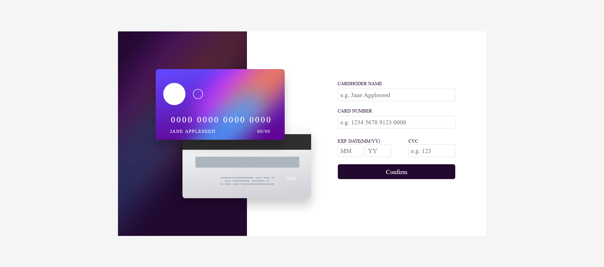

# Frontend Mentor - Interactive card details form solution

This is a solution to the [Interactive card details form challenge on Frontend Mentor](https://www.frontendmentor.io/challenges/interactive-card-details-form-XpS8cKZDWw). Frontend Mentor challenges help you improve your coding skills by building realistic projects. 

## Table of contents

- [Overview](#overview)
  - [The challenge](#the-challenge)
  - [Screenshot](#screenshot)
  - [Links](#links)
- [My process](#my-process)
  - [Built with](#built-with)
  - [What I learned](#what-i-learned)
  - [Continued development](#continued-development)
  - [Useful resources](#useful-resources)
- [Author](#author)
- [Acknowledgments](#acknowledgments)

## Overview

### The challenge

Users should be able to:

- Fill in the form and see the card details update in real-time
- Receive error messages when the form is submitted if:
  - Any input field is empty
  - The card number, expiry date, or CVC fields are in the wrong format
- View the optimal layout depending on their device's screen size
- See hover, active, and focus states for interactive elements on the page

### Screenshot



### Links

- Solution URL: [Add solution URL here](https://www.frontendmentor.io/solutions/responsive-and-interactive-card-details-form-XTVciy4Gmn)
- Live Site URL: [Add live site URL here](https://abdulelah-abacar.github.io/interactive-card-details-form-main/)

## My process

### Built with

- Semantic HTML5 markup
- CSS custom properties
- Flexbox
- CSS Grid
- Mobile-first workflow

### What I learned

I really take a lot of time to code this section because it should see if the card-number inputs have any letter in and that was so difficult because the card-number content spaces in.

```js
cardNum.addEventListener("keyup", () => {
  if (isNaN(cardNum.value.trim().split("").join(""))) {
    cardNum.parentElement.lastElementChild.textContent = "Wrong format, number only";
    cardNum.parentElement.lastElementChild.style.display = "block";
    cardNum.style.borderColor = "hsl(0, 100%, 66%)";
    cardNum.removeEventListener("blur", () => {
      cardNum.style.borderColor = "hsl(0, 100%, 66%)";
    })
  } else {
    cardNum.parentElement.lastElementChild.style.display = "none";
    cardNum.style.borderColor = "rgb(222, 221, 223)";
  }
})

if (cardNum.value.trim().split("")[4] == " ") {
  cardNumOnImg.textContent = cardNum.value.trim() == "" ? "0000 0000 0000 0000": cardNum.value.trim().split("").length >= 4 ? cardNum.value.trim().split("").join("").match(/(.... ?)/g).join(" "): "0000 0000 0000 0000";
  cardNum.parentElement.lastElementChild.textContent = "";
  cardNum.style.borderColor = "rgb(222, 221, 223)";
} else {
  cardNumOnImg.textContent = cardNum.value.trim() == "" ? "0000 0000 0000 0000": cardNum.value.trim().split("").length >= 4 ? cardNum.value.trim().split("").join("").match(/(....)/g).join(" "): "0000 0000 0000 0000";
}
```

### Continued development

### Useful resources

## Author

- Frontend Mentor - [@Abdulelah-Abacar](https://www.frontendmentor.io/profile/Abdulelah-Abacar)

## Acknowledgments

